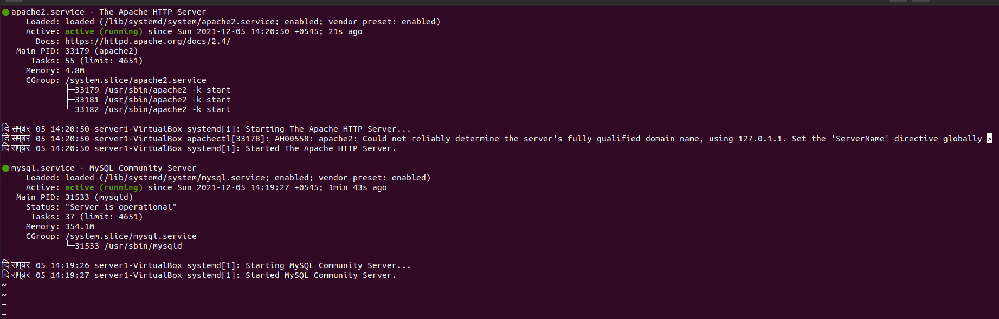

# Zabbix

## Q.1.

1. Install Zabbix dependencies
    
     1.1. Install LAMP stack
    
    1.1.1 Install apache, mysql , php
    
    ```bash
    sudo apt update
    sudo apt install mysql-server -y
    sudo apt install apache2 
    ```
    
    
    
    1.1.2 Login to the `mysql` console using `sudo mysql`
    
    1.1.3 Create database and user for zabbix
    
    ```sql
    create database zabbix character set utf8 collate utf8_bin;
    create user zabbix@localhost identified by 'zabbix';
    grant all privileges on zabbix.* to zabbix@localhost;
    quit;
    ```
    
    
    

## Q.2.

Install Zabbix Server with `mysql` support and Zabbix Frontend

2.1 Install Zabbix repository

```bash
wget https://repo.zabbix.com/zabbix/5.0/ubuntu/pool/main/z/zabbix-release/zabbix-release_5.0-1+focal_all.deb
sudo dpkg -i zabbix-release_5.0-1+focal_all.deb 
sudo apt update -y
```

 2.2 Install Zabbix server and apache module

```bash
sudo apt install zabbix-server-mysql zabbix-apache-conf 
```

2.3 Install Zabbix frontend

```bash
sudo apt install zabbix-frontend-php
```

2.4 Import schema and initial data for zabbix

```bash
zcat /usr/share/doc/zabbix-server-mysql*/create.sql.gz | mysql -u zabbix -p
```


2.5 Configure database for Zabbix server

Insert/Modify the following lines in `/etc/zabbix/zabbix_server.conf`

```bash
DBPassword=zabbix
```

2.6 Configure PHP

Insert/Modify the file `/etc/zabbix/apache.conf` with the following

```
<IfModule mod_php7.c>
        php_value max_execution_time 300
        php_value memory_limit 128M
        php_value post_max_size 16M
        php_value upload_max_filesize 2M
        php_value max_input_time 300
        php_value max_input_vars 10000
        php_value always_populate_raw_post_data -1
        php_value date.timezone Asia/Kathmandu
    </IfModule>
```

2.7 Enable and Start Zabbix Server

```bash
systemctl enable zabbix-server apache2
systemctl restart zabbix-server apache2
```


## Q.3.

3.1 Install Latest Zabbix Agent on `server2`

3.1.1 Install Zabbix repository as done in Q.1

3.1.2 Install Zabbix Agent 

```bash
sudo apt install zabbix-agent
```


3.2  Configure Zabbix Agent to run as Active Check agent

Insert/Modify the following lines in the `/etc/zabbix/zabbix_agentd.conf` file in `server2`:

```bash
Server=0.0.0.0/0
ListenIp=192.168.0.6
ServerActive=192.168.0.7
Hostname=server2
```


3.3 Pull logs from zabbix agent

3.3.1 Create Host


3.3.2 Create an item for `syslog`


You can name this anything. 

Make sure to change:

 `Type` to `Zabbix agent (active)`

`Type of Information` to `Log`

`Key` to `log[/var/log/syslog]`

3.3.4 Provide `zabbix` user permission to read `/var/log/syslog`

```bash
usermod -G adm zabbix
```

3.3.5 Verify that `syslog` are being sent:

```bash
python3 -c 'import syslog;syslog.log("Hello Leapfrog")'
```


3.4 See the graphs for `server1`


3.5 See the graphs for `server2`

These graphs were generated after linking the linux os template.


